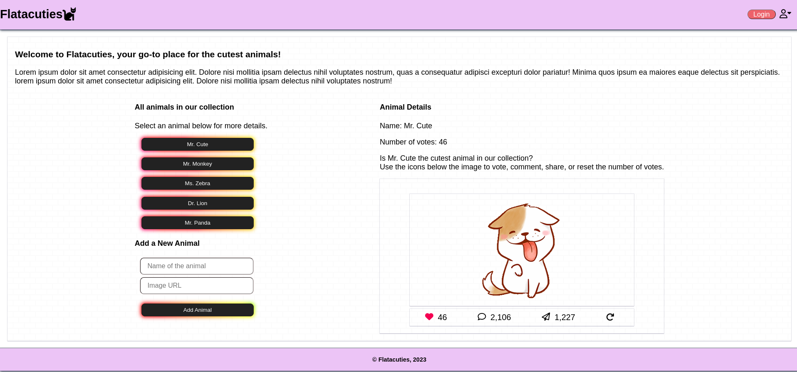

# Phase 1 : Week 2 Code Challenge

[](https://opensource.org/licenses/MIT)
[](https://www.javascript.com)

## Flatacuties Mini Web App

## Introduction

This is a code challenge for Phase 1 Week 2 whose aim is implementing a mini web app to practice on:

- `Array Iteration`
- `DOM Manipulation`
- `JavaScript Events`
- `Server Communication`

This challenge involves working on Flatacuties, an app where one can vote for the cutest animal. I will use a local API and build out a simple frontend for the app.

Below is an image of the mini web app:



## Project Setup

### 1. Clone the repository
```
$ git clone https://github.com/ArshavineRoy/phase-1-week-2-code-challenge
```

### 2. Navigate to the project directory
```
$ cd phase-1-week-2-code-challenge
```

### 5. Install and start JSON server

Install the JSON server

```
$ npm install -g json-server
```
Start JSON Server (from within the project directory)

```
$ json-server --watch db.json
```

Test the server by visiting this route in the browser

```
$ http://localhost:3000/characters
```

### 6. View and interact with the web app

Use this link to open the web app deployed via GitHub Pages

```
$ https://arshavineroy.github.io/phase-1-week-2-code-challenge/

```

### Alternatives to running the app
### 6.1 Run the web app from its HTML file

Open `index.html` on your browser, preferably Chrome.

### 6.2 Run the project from Visual Studio Code

Navigate to the repo directory in the `terminal`, and type `code .` to open the project in VS Code.

- Alternatively, run VS Code and open the project repo folder directly.

### 6.2.2 Install Live Server extension

Open `Extensions` in VS Code `(Ctrl+Shift+X)`, search for `Live Server` by `Ritwick Dey`, and click `Install`.

Open `index.html` and right-click anywehre within the file and select `Open with Live Server` from the context menu.

This will automatically launch a local development server and open the mini app in your default web browser.


## Core Deliverables for this Challenge
A user should be able to:

1. See a list of all animal names. A GET request is made to the following endpoint to retrieve the character data
```js
$ GET /characters
```

Example Response:

```json
   {

     "id": 1,

     "name": "Mr. Cute",

     "image": "https://thumbs.gfycat.com/EquatorialIckyCat-max-1mb.gif",

     "votes": 0

   },

   {

     "id": 2,

     "name": "Mx. Monkey",

     "image": "https://thumbs.gfycat.com/FatalInnocentAmericanshorthair-max-1mb.gif",

     "votes": 0   },
```

2. Click on an animal’s name to see its details i.e., image and number of votes. Details should be displayed for one animal at a time. To get get a character's details:

```js
$ GET /characters/:id
```
Example Response:

```json
{

     "id": 1,

     "name": "Mr. Cute",

     "image": "https://thumbs.gfycat.com/EquatorialIckyCat-max-1mb.gif",

     "votes": 0

   },
```

3. When viewing an animal’s details, the user should be able to add the number of votes for each animal. The number of votes should then be displayed together with the animal’s details. No persistence is needed for the votes.

The server DB for this web has been obtained from

```json
{
  "characters": [
    {
      "id": 1,
      "name": "Mr. Cute",
      "image": "https://thumbs.gfycat.com/EquatorialIckyCat-max-1mb.gif",
      "votes": 45
    },
    {
      "id": 2,
      "name": "Mr. Monkey",
      "image": "https://thumbs.gfycat.com/FatalInnocentAmericanshorthair-max-1mb.gif",
      "votes": 33
    },
    {
      "id": 3,
      "name": "Ms. Zebra",
      "image": "https://media2.giphy.com/media/20G9uNqE3K4dRjCppA/source.gif",
      "votes": 104
    },
    {
      "id": 4,
      "name": "Dr. Lion",
      "image": "http://bestanimations.com/Animals/Mammals/Cats/Lions/animated-lion-gif-11.gif",
      "votes": 23
    },
    {
      "id": 5,
      "name": "Mr. Panda",
      "image": "https://media.giphy.com/media/ALalVMOVR8Qw/giphy.gif",
      "votes": 12
    }
  ]
}
```

## Bonus Deliverables

- Add a reset button that resets the votes back to 0. (done)
- Have a form for adding animals.

## Author & License

Authored by [Arshavine Waema](https://github.com/ArshavineRoy).

Licensed under the [MIT License](LICENSE) - see the [LICENSE](LICENSE) file for details.
